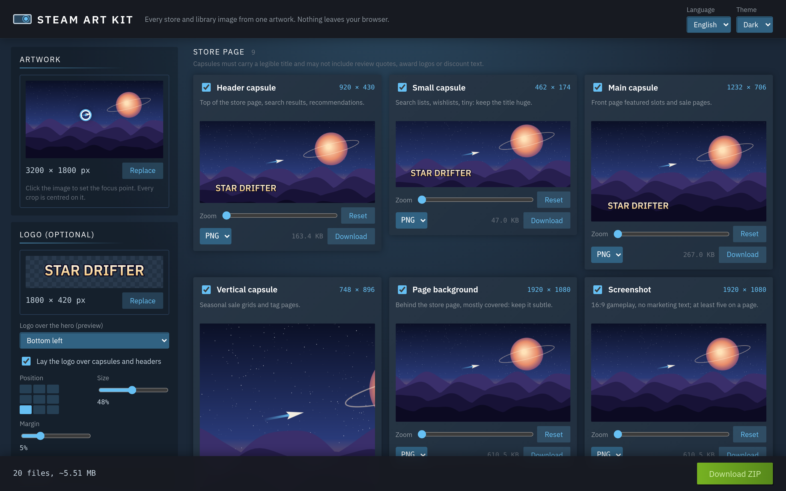
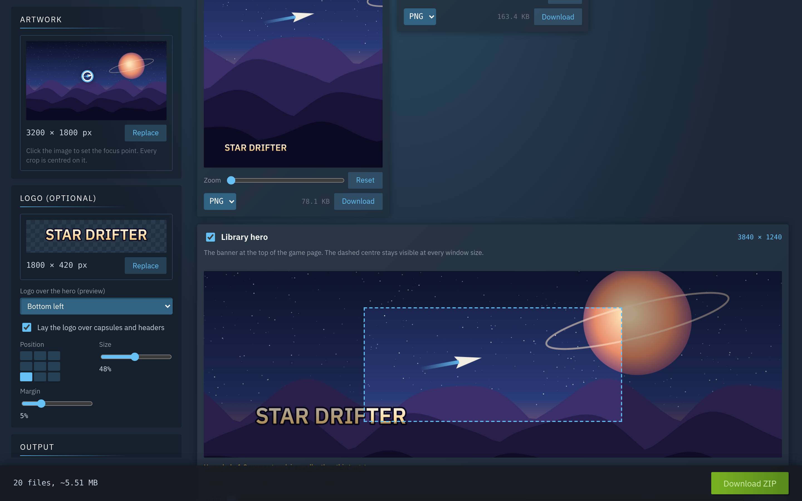

<h1 align="center">Steam Art Kit</h1>

<p align="center">
  <b>Every Steam store and library image from one artwork, in the browser.</b><br>
  Capsules, headers, hero, logo, screenshots, icons and your own custom library art, cropped around a focus point,
  previewed at the size Steam shows them, downloaded one by one or as a ZIP. Nothing is uploaded anywhere.
</p>

<p align="center">
  
</p>

**Live:** https://ardakalper.github.io/steam-art-kit/

## Why

A Steam page needs about twenty images in fixed sizes, and the 2024 refresh doubled most of them. Cutting them by hand
in an image editor is slow and easy to get wrong. Drop your key art in once, click where the action is, and every
target is ready; nudge any single one by dragging it.

## Features

- **All the targets, current sizes:** header 920×430, small 462×174, main 1232×706, vertical 748×896, page background
  1920×1080, screenshots 1920×1080, event cover 800×450 and header 1920×622, bundle header 1438×810, library capsule
  600×900, library header 920×430, library hero 3840×1240, library logo (fits 1280×720), community icon 184×184 and
  client icon (.ico). Optional pre-2024 sizes (460×215, 231×87, 616×353, 374×448, 1438×810) for press kits.
- **Focus point:** click the artwork once; every crop is centred on that spot and never leaves the image.
- **Per-card control:** drag inside a preview to reposition, wheel or slider to zoom, reset, choose PNG or JPG.
- **Logo tools:** a transparent logo becomes the library logo, trimmed to its own shape inside 1280×720. It can be laid
  over capsules on a 3×3 grid with size and margin, and it is previewed over the hero where the Steam client pins it
  (bottom left, top centre, centre, bottom centre) without being baked into the file.
- **Safe areas and warnings:** the hero shows its always-visible centre, cards warn when your art is too small and
  would be upscaled, and each group repeats Steam's text rules (no review quotes, awards or discount text on capsules,
  no words on the hero).
- **Custom library art:** the same engine makes grid, wide grid, hero, logo and icon for any game you own. Enter an app
  ID and the files are named the way the client's grid folder expects (`620p.png`, `620_hero.png`, `620_logo.png`…).
- **Output:** exact pixel sizes, high-quality stepwise downscaling, JPG quality and background colour, `.ico` files with
  16–256 px inside, file-size estimates per card, and one ZIP organised by `store/`, `library/`, `custom/`,
  `community/`.
- **Private and offline:** everything runs on canvas in your browser; installs as an app and works without a
  connection. English and Turkish, dark and light themes.
- Plain HTML, CSS and ES modules. No build step, no runtime dependencies (own ZIP and ICO writers).

<p align="center">
  
</p>

## Run it locally

```sh
git clone https://github.com/ardakalper/steam-art-kit
cd steam-art-kit
npm start            # serves app/ on http://localhost:4175
```

## Tests

```sh
npm install
npm run test:unit    # presets, crop and fit maths, ZIP and ICO writers, i18n parity (node --test)
npm run test:e2e     # Playwright: real uploads, focus clicks, drags, exact output sizes, ZIP contents
```

Set `PW_CHROMIUM_PATH=/path/to/chrome` to reuse an installed Chromium. CI runs both suites on every push and deploys
`app/` to GitHub Pages when `main` is green.

## How it is built

```
app/
  index.html        layout: artwork, logo and output panels, card template, export bar
  css/app.css       tokens (dark / light), layout, cards
  js/presets.js     every Steam target: size, display size, formats, legacy size, safe area, grid-folder name
  js/crop.js        pure maths: cover crop around a focus point with zoom and pan, logo fit, overlay placement,
                    hero logo pins, stepwise downscale plan, file names
  js/zip.js         ZIP writer (stored entries, CRC-32) and a reader for tests
  js/ico.js         ICO writer with PNG entries
  js/main.js        the UI: decoding, previews, dragging, rendering, size estimates, export
  js/i18n.js        English and Turkish
tests/              node:test unit tests and Playwright e2e specs with generated fixture images
tools/              static server, icon generator, screenshot script
```

Previews draw from a downscaled copy of the artwork so dragging stays smooth; exports draw from the original and halve
it step by step before the final resize, which keeps small capsules sharp.

## Sizes change

Steam revises its asset specs from time to time. All sizes live in `app/js/presets.js`; check the Steamworks
documentation before a launch and open an issue if something moved.

## Credits

Independent tool, not affiliated with or endorsed by Valve. Steam is a trademark of Valve Corporation. The interface
colours echo the Steam client so it feels familiar; no Valve logos or artwork are used. IBM Plex Sans is bundled under
the SIL Open Font License 1.1.

## License

MIT.

---

### Türkçe özet

**Steam Art Kit**, tek bir ana görselden Steam'in istediği tüm mağaza ve kütüphane görsellerini tarayıcıda üretir:
header, küçük, ana ve dikey kapsül, sayfa arka planı, ekran görüntüsü, etkinlik görselleri, paket header, kütüphane
kapsülü, header, hero ve logo, topluluk simgesi ve istemci simgesi (.ico). Görsele bir kez tıklayıp odak noktasını
seçersin, her kırpma onun etrafında ortalanır; istediğin kartı sürükleyip yakınlaştırabilirsin. Şeffaf logo kütüphane
logosuna dönüşür, istersen kapsüllerin üstüne bindirilir ve hero üzerinde istemcinin koyduğu yerde önizlenir. Kendi
kütüphanen için özel görseller de üretir; uygulama ID'si girersen dosyalar grid klasörünün beklediği adlarla çıkar.
Tüm dosyalar tek ZIP olarak iner. Hiçbir şey yüklenmez, çevrimdışı çalışır, Türkçe ve İngilizce, koyu tema varsayılan.
